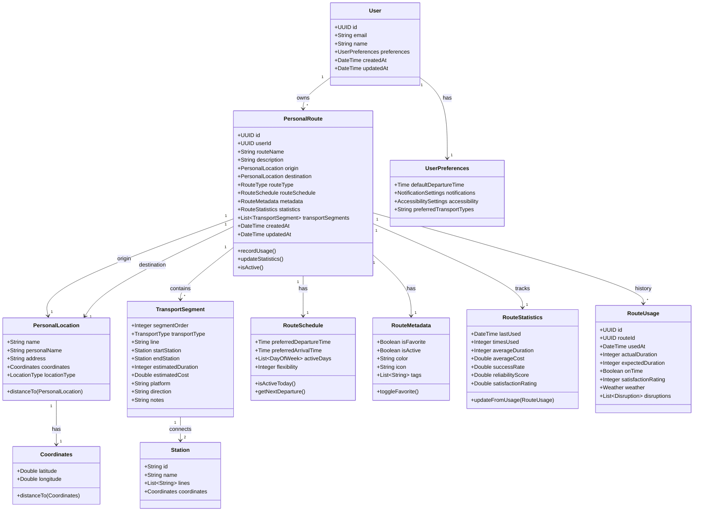
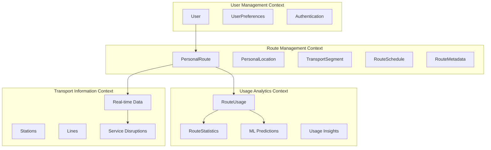
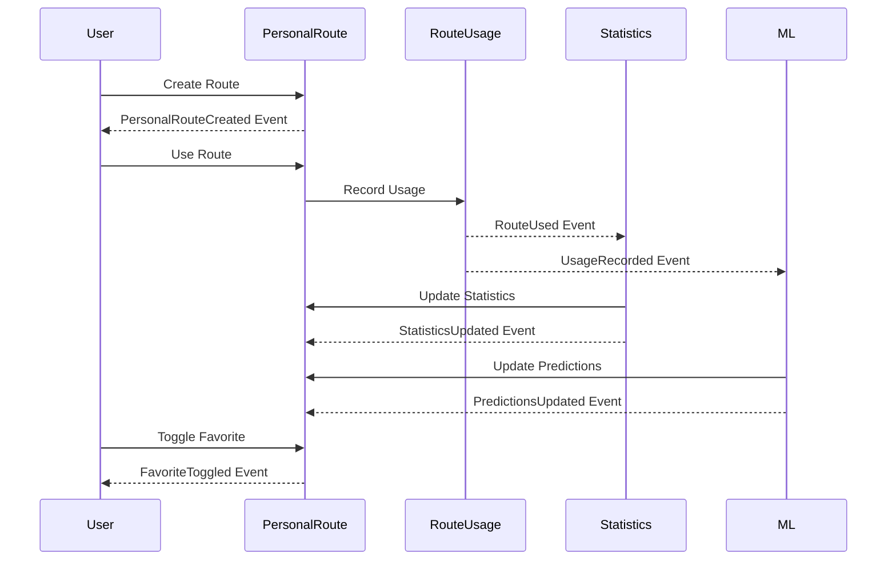

# Unified Domain Model - Personal Transport Assistant

This document defines the domain model for the Personal Transport Assistant, aligned with the vision of user-centered transport optimization.

## Domain Model Overview

## Bounded Contexts

## Aggregates and Aggregate Roots

### User Aggregate
- **Root**: User
- **Entities**: UserPreferences
- **Boundaries**: User profile management, authentication
- **Invariants**: Email must be unique, preferences must be valid

### PersonalRoute Aggregate
- **Root**: PersonalRoute
- **Value Objects**: PersonalLocation, Coordinates, RouteSchedule, RouteMetadata, RouteStatistics
- **Entities**: TransportSegment
- **Boundaries**: Route definition, metadata, and basic statistics
- **Invariants**: Route must have origin and destination, segments must be ordered, route name must be unique per user

### RouteUsage Aggregate
- **Root**: RouteUsage
- **Boundaries**: Individual usage events and analytics
- **Invariants**: Usage must reference valid route, timestamps must be consistent

## Domain Events

## Key Domain Events

1. **PersonalRouteCreated** - New route added to user's collection
2. **PersonalRouteUpdated** - Route metadata or segments changed
3. **PersonalRouteUsed** - User completed a journey using this route
4. **FavoriteRouteToggled** - Route favorite status changed
5. **RouteStatisticsUpdated** - Statistics recalculated from usage data
6. **RouteDeactivated** - Route marked as no longer active
7. **UsagePatternsDetected** - ML system detected new usage patterns

## Value Objects Details

### RouteType Enum
- `DAILY_COMMUTE` - Regular work commute
- `WEEKLY_ROUTINE` - Weekly recurring trips
- `OCCASIONAL` - Infrequent but remembered routes
- `WEEKEND` - Weekend/leisure routes
- `SPECIAL` - Event-specific routes

### LocationType Enum
- `HOME` - Primary residence
- `WORK` - Workplace or office
- `FRIEND` - Friend's or family's place
- `GYM` - Fitness center
- `SCHOOL` - Educational institution
- `SHOPPING` - Shopping center or market
- `RESTAURANT` - Dining location
- `OTHER` - General purpose location

### TransportType Enum
- `METRO` - Underground/subway
- `BUS` - Bus service
- `TRAM` - Tram/streetcar
- `TRAIN` - Regional/national train
- `WALK` - Walking segment
- `BIKE` - Bicycle (personal or shared)
- `CAR` - Car (personal or shared)

## Business Rules

### PersonalRoute Rules
1. A route must have exactly one origin and one destination
2. Transport segments must be ordered sequentially
3. Route name must be unique per user
4. Inactive routes are hidden from main views but preserved for history
5. Favorite routes appear at the top of user's route list

### RouteUsage Rules
1. Usage can only be recorded for active routes
2. Actual duration must be positive
3. Satisfaction rating must be between 1-5
4. On-time calculation based on expected vs actual arrival time

### Statistics Rules
1. Statistics are computed from usage history
2. Success rate = percentage of on-time arrivals
3. Reliability score combines success rate, duration consistency, and user satisfaction
4. Statistics are updated asynchronously after usage recording

## Integration Points

### External Systems
- **Transport APIs** - Real-time arrival information
- **Mapping Services** - Geocoding and route calculation
- **Weather APIs** - Context for usage analysis
- **Push Notifications** - Departure reminders and alerts

### Internal Services
- **Authentication Service** - User identity management
- **Analytics Service** - Usage pattern analysis and ML
- **Notification Service** - User alerts and reminders

## Future Extensions

### Planned Features
- **Route Sharing** - Share routes with other users
- **Group Coordination** - Coordinate departures with friends/colleagues
- **Smart Suggestions** - AI-powered route optimization suggestions
- **Predictive Departures** - Optimal departure time recommendations
- **Weather Integration** - Route adaptations based on weather conditions
- **Event Awareness** - Adjustments for local events affecting transport

### Domain Evolution
- **SocialRoute Aggregate** - For shared and group routes
- **PredictiveModel Aggregate** - For AI/ML predictions
- **EventContext Value Object** - For external events affecting routes