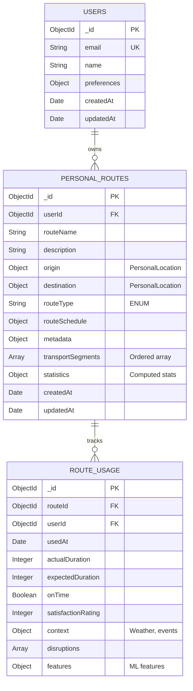
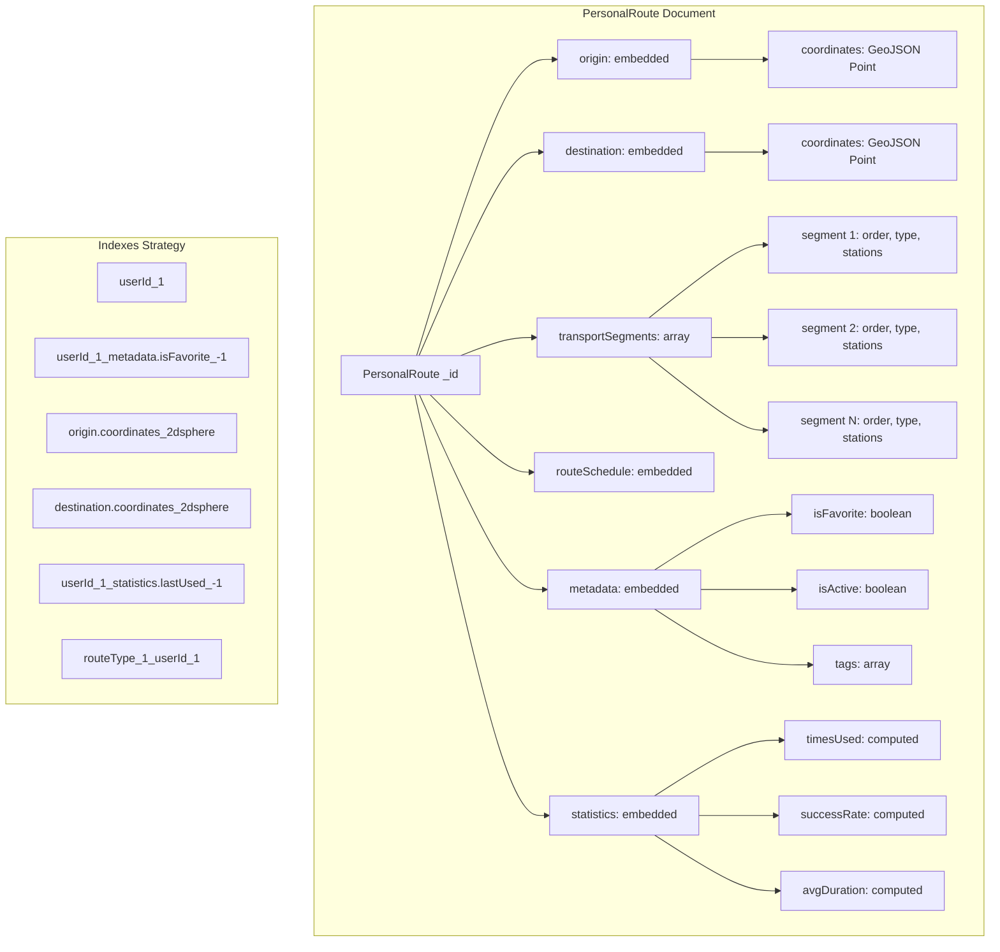
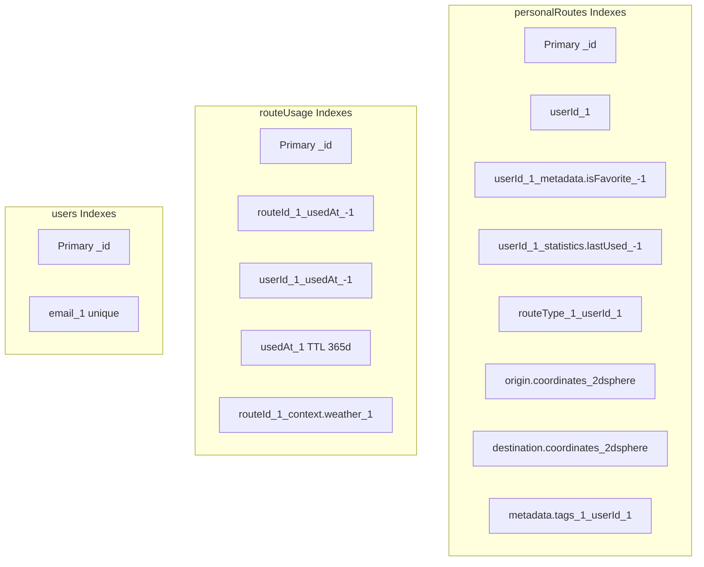
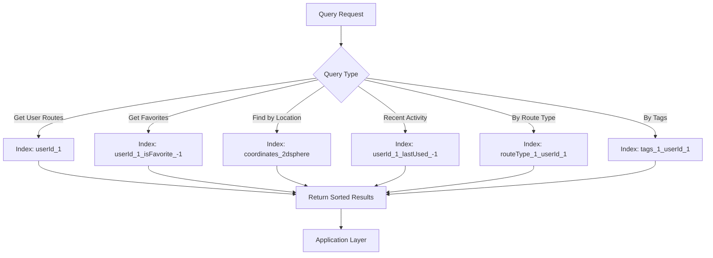
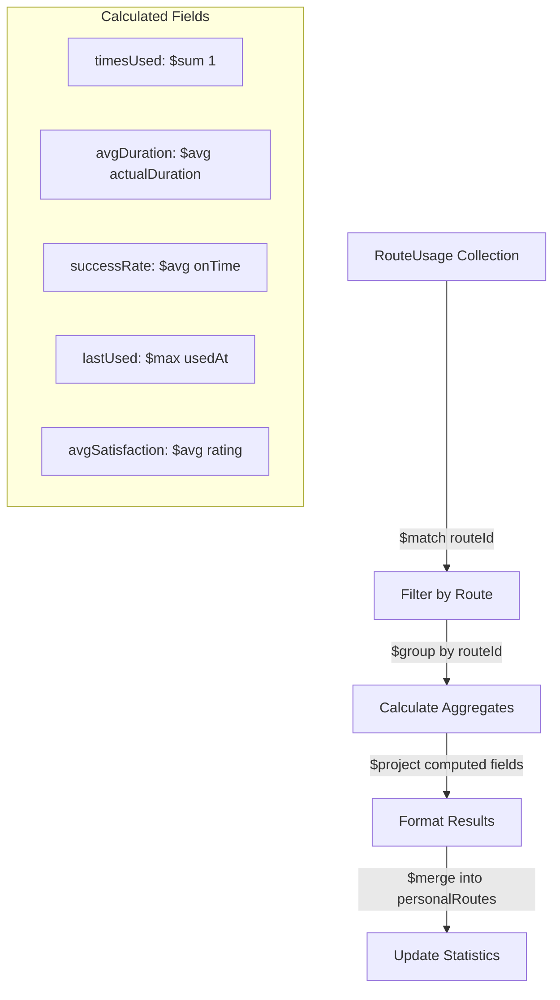
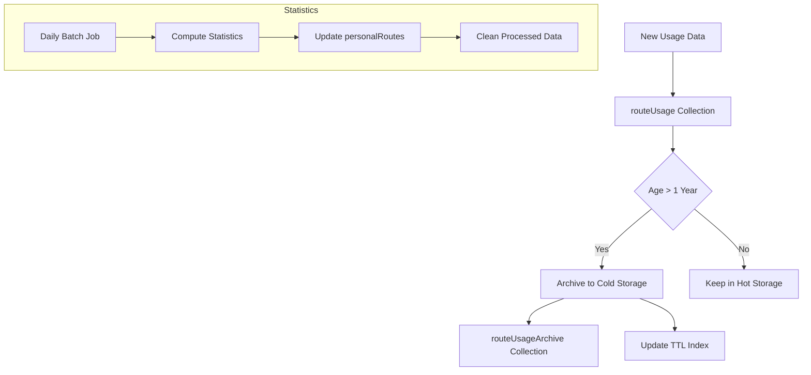

# MongoDB Schema Design - Personal Routes

This document defines the MongoDB schema design optimized for the Personal Transport Assistant, treating PersonalRoute as rich documents with embedded data for optimal read performance.

## Collection Architecture Overview



## Document Structure Visualization



## Detailed Schema Definitions

### users Collection

```javascript
{
  _id: ObjectId("60f8b2c4d5e6f7a8b9c0d1e2"),
  email: "florent@example.com",
  name: "Florent Bonafons",
  preferences: {
    defaultDepartureTime: "08:30",
    notificationSettings: {
      departureReminder: true,
      delayAlerts: true,
      reminderMinutes: 15,
      weekendsEnabled: false
    },
    accessibility: {
      wheelchairAccess: false,
      avoidStairs: false,
      preferredTransportTypes: ["METRO", "BUS"]
    },
    privacy: {
      shareUsageStats: false,
      allowRouteRecommendations: true
    }
  },
  createdAt: ISODate("2025-01-01T00:00:00Z"),
  updatedAt: ISODate("2025-01-08T10:30:00Z")
}
```

### personalRoutes Collection

```javascript
{
  _id: ObjectId("60f8b2c4d5e6f7a8b9c0d1e3"),
  userId: ObjectId("60f8b2c4d5e6f7a8b9c0d1e2"),
  routeName: "Morning commute to office",
  description: "Fastest route during rush hour, avoid Line 13 delays",
  
  // Embedded PersonalLocation objects
  origin: {
    name: "Gare du Nord",
    personalName: "Home area",
    address: "18 Rue de Dunkerque, 75010 Paris, France",
    coordinates: {
      type: "Point",
      coordinates: [2.3553, 48.8809] // [longitude, latitude] for GeoJSON
    },
    locationType: "HOME"
  },
  
  destination: {
    name: "La Défense Grande Arche",
    personalName: "Office",
    address: "1 Parvis de la Défense, 92800 Puteaux, France",
    coordinates: {
      type: "Point",
      coordinates: [2.2385, 48.8920]
    },
    locationType: "WORK"
  },
  
  routeType: "DAILY_COMMUTE",
  
  // Embedded route schedule
  routeSchedule: {
    preferredDepartureTime: "08:30",
    preferredArrivalTime: "09:15",
    activeDays: ["MONDAY", "TUESDAY", "WEDNESDAY", "THURSDAY", "FRIDAY"],
    flexibility: 10 // minutes acceptable delay
  },
  
  // Embedded metadata for UI and personalization
  metadata: {
    isFavorite: true,
    isActive: true,
    color: "#FF5733", // UI color theme
    icon: "work", // UI icon identifier
    tags: ["rush-hour", "metro", "reliable", "fastest"],
    notes: "Platform 1 is usually less crowded"
  },
  
  // Ordered array of transport segments
  transportSegments: [
    {
      segmentOrder: 1,
      transportType: "WALK",
      estimatedDuration: 5,
      estimatedCost: 0,
      notes: "Walk to Château d'Eau metro entrance"
    },
    {
      segmentOrder: 2,
      transportType: "METRO",
      line: "4",
      startStation: {
        id: "IDFM:22387",
        name: "Château d'Eau",
        coordinates: {
          type: "Point",
          coordinates: [2.3553, 48.8709]
        }
      },
      endStation: {
        id: "IDFM:22092", 
        name: "Châtelet",
        coordinates: {
          type: "Point",
          coordinates: [2.3470, 48.8583]
        }
      },
      estimatedDuration: 8,
      estimatedCost: 0, // Covered by monthly pass
      platform: "Direction Mairie de Montrouge",
      direction: "Mairie de Montrouge",
      notes: "Middle carriages are less crowded"
    },
    {
      segmentOrder: 3,
      transportType: "METRO",
      line: "1",
      startStation: {
        id: "IDFM:22091",
        name: "Châtelet",
        coordinates: {
          type: "Point",
          coordinates: [2.3470, 48.8583]
        }
      },
      endStation: {
        id: "IDFM:22026",
        name: "La Défense Grande Arche",
        coordinates: {
          type: "Point",
          coordinates: [2.2385, 48.8920]
        }
      },
      estimatedDuration: 12,
      estimatedCost: 0,
      platform: "Direction La Défense",
      direction: "La Défense",
      notes: "Exit at front of train for faster walk to office"
    },
    {
      segmentOrder: 4,
      transportType: "WALK",
      estimatedDuration: 7,
      estimatedCost: 0,
      notes: "Walk to office building, use covered path when raining"
    }
  ],
  
  // Computed statistics (updated via aggregation pipeline)
  statistics: {
    lastUsed: ISODate("2025-01-08T08:32:00Z"),
    timesUsed: 145,
    averageDuration: 32, // minutes
    averageCost: 0, // covered by monthly pass
    successRate: 0.87, // 87% on-time arrival rate
    reliabilityScore: 8.5, // 0-10 computed score
    satisfactionRating: 4.2, // 1-5 average user rating
    totalDistance: 15.2, // kilometers
    carbonFootprint: 2.1 // kg CO2 equivalent
  },
  
  createdAt: ISODate("2024-09-15T07:00:00Z"),
  updatedAt: ISODate("2025-01-08T08:35:00Z")
}
```

### routeUsage Collection (Time-Series Optimized)

```javascript
{
  _id: ObjectId("60f8b2c4d5e6f7a8b9c0d1e4"),
  routeId: ObjectId("60f8b2c4d5e6f7a8b9c0d1e3"),
  userId: ObjectId("60f8b2c4d5e6f7a8b9c0d1e2"),
  
  // Usage timing
  usedAt: ISODate("2025-01-08T08:32:00Z"),
  plannedDeparture: ISODate("2025-01-08T08:30:00Z"),
  actualArrival: ISODate("2025-01-08T09:07:00Z"),
  
  // Performance metrics
  actualDuration: 35, // minutes
  expectedDuration: 32, // minutes from route definition
  onTime: false,
  delay: 3, // minutes late
  
  // User feedback
  satisfactionRating: 4, // 1-5 scale
  
  // Context information for ML/analytics
  context: {
    weather: "RAINY",
    temperature: 5, // Celsius
    dayType: "WEEKDAY",
    rushHour: true,
    isHoliday: false,
    season: "WINTER"
  },
  
  // Service disruptions encountered
  disruptions: [
    {
      type: "DELAY",
      line: "METRO_4",
      station: "Châtelet",
      reason: "Technical incident",
      impact: 5, // minutes delay
      severity: "MEDIUM"
    }
  ],
  
  // Segment-level performance (optional detailed tracking)
  segmentPerformance: [
    { segmentOrder: 1, actualDuration: 5, expectedDuration: 5, onTime: true },
    { segmentOrder: 2, actualDuration: 13, expectedDuration: 8, onTime: false },
    { segmentOrder: 3, actualDuration: 12, expectedDuration: 12, onTime: true },
    { segmentOrder: 4, actualDuration: 5, expectedDuration: 7, onTime: true }
  ],
  
  // Features for ML model training
  features: {
    departureHour: 8,
    departureMinute: 30,
    dayOfWeek: 3, // Wednesday = 3
    monthOfYear: 1, // January = 1
    isRushHour: true,
    weatherCode: 2, // Rainy = 2
    temperatureRange: 1, // Cold = 1
    seasonCode: 4 // Winter = 4
  }
}
```

## Index Strategy



### Index Definitions

```javascript
// personalRoutes collection indexes
db.personalRoutes.createIndex({ userId: 1 })
db.personalRoutes.createIndex({ userId: 1, "metadata.isFavorite": -1 })
db.personalRoutes.createIndex({ userId: 1, "statistics.lastUsed": -1 })
db.personalRoutes.createIndex({ routeType: 1, userId: 1 })
db.personalRoutes.createIndex({ "origin.coordinates": "2dsphere" })
db.personalRoutes.createIndex({ "destination.coordinates": "2dsphere" })
db.personalRoutes.createIndex({ "metadata.tags": 1, userId: 1 })
db.personalRoutes.createIndex({ 
  userId: 1, 
  "metadata.isActive": 1, 
  "statistics.lastUsed": -1 
})

// routeUsage collection indexes
db.routeUsage.createIndex({ routeId: 1, usedAt: -1 })
db.routeUsage.createIndex({ userId: 1, usedAt: -1 })
db.routeUsage.createIndex({ routeId: 1, "context.weather": 1 })
db.routeUsage.createIndex({ 
  usedAt: 1 
}, { 
  expireAfterSeconds: 31536000 // TTL: 1 year
})

// users collection indexes
db.users.createIndex({ email: 1 }, { unique: true })
```

## Query Patterns and Performance

### Common Query Patterns



### Optimized Query Examples

```javascript
// Get user's favorite routes, most recently used first
db.personalRoutes.find({
  userId: ObjectId("..."),
  "metadata.isFavorite": true,
  "metadata.isActive": true
}).sort({
  "statistics.lastUsed": -1
}).limit(10)

// Find routes starting near a location (within 1km)
db.personalRoutes.find({
  userId: ObjectId("..."),
  "origin.coordinates": {
    $near: {
      $geometry: {
        type: "Point",
        coordinates: [2.3522, 48.8566] // [lon, lat]
      },
      $maxDistance: 1000 // meters
    }
  }
})

// Get usage statistics for the last month
db.routeUsage.find({
  routeId: ObjectId("..."),
  usedAt: {
    $gte: ISODate("2024-12-08T00:00:00Z"),
    $lte: ISODate("2025-01-08T23:59:59Z")
  }
}).sort({ usedAt: -1 })

// Find similar routes by tags and type
db.personalRoutes.find({
  userId: ObjectId("..."),
  routeType: "DAILY_COMMUTE",
  "metadata.tags": { $in: ["metro", "reliable"] }
})
```

## Aggregation Pipelines

### Update Route Statistics (Batch Processing)



```javascript
// Aggregation pipeline to update route statistics
db.routeUsage.aggregate([
  {
    $match: {
      usedAt: { 
        $gte: ISODate("2025-01-01T00:00:00Z") // Last month
      }
    }
  },
  {
    $group: {
      _id: "$routeId",
      timesUsed: { $sum: 1 },
      avgDuration: { $avg: "$actualDuration" },
      successRate: { 
        $avg: { $cond: ["$onTime", 1, 0] }
      },
      lastUsed: { $max: "$usedAt" },
      avgSatisfaction: { $avg: "$satisfactionRating" },
      totalDelay: { $sum: "$delay" }
    }
  },
  {
    $addFields: {
      reliabilityScore: {
        $multiply: [
          { $add: [
            { $multiply: ["$successRate", 6] }, // 60% weight to success rate
            { $multiply: ["$avgSatisfaction", 4] } // 40% weight to satisfaction
          ]},
          1
        ]
      }
    }
  },
  {
    $merge: {
      into: "personalRoutes",
      on: "_id",
      whenMatched: [{
        $set: {
          statistics: {
            timesUsed: "$$new.timesUsed",
            avgDuration: { $round: ["$$new.avgDuration", 0] },
            successRate: { $round: ["$$new.successRate", 2] },
            lastUsed: "$$new.lastUsed",
            satisfactionRating: { $round: ["$$new.avgSatisfaction", 1] },
            reliabilityScore: { $round: ["$$new.reliabilityScore", 1] }
          },
          updatedAt: "$$NOW"
        }
      }]
    }
  }
])
```

### ML Feature Extraction

```javascript
// Extract features for machine learning model
db.routeUsage.aggregate([
  {
    $match: {
      usedAt: { $gte: ISODate("2024-01-01T00:00:00Z") }
    }
  },
  {
    $lookup: {
      from: "personalRoutes",
      localField: "routeId",
      foreignField: "_id",
      as: "route"
    }
  },
  {
    $unwind: "$route"
  },
  {
    $project: {
      routeId: 1,
      userId: 1,
      delay: 1,
      onTime: 1,
      routeType: "$route.routeType",
      segmentCount: { $size: "$route.transportSegments" },
      hasMetro: {
        $in: ["METRO", "$route.transportSegments.transportType"]
      },
      departureHour: { $hour: "$usedAt" },
      dayOfWeek: { $dayOfWeek: "$usedAt" },
      weather: "$context.weather",
      temperature: "$context.temperature"
    }
  }
])
```

## Data Archival and Cleanup Strategy

### Time-Series Data Management



### Archive Strategy

```javascript
// Create archival collection with different retention
db.createCollection("routeUsageArchive")
db.routeUsageArchive.createIndex({ 
  usedAt: 1 
}, { 
  expireAfterSeconds: 94608000 // TTL: 3 years
})

// Monthly archival job
db.routeUsage.find({
  usedAt: { $lt: ISODate("2024-01-08T00:00:00Z") }
}).forEach(function(doc) {
  db.routeUsageArchive.insert(doc);
  db.routeUsage.remove({ _id: doc._id });
});
```

## Performance Considerations

### Read Optimization
- **Single Document Reads**: PersonalRoute contains everything needed for UI
- **Embedded Documents**: No joins required for route display
- **Strategic Indexes**: Cover common query patterns
- **GeoSpatial Queries**: 2dsphere indexes for location-based searches

### Write Optimization
- **Separate Collections**: High-frequency writes (routeUsage) separate from read-heavy data (personalRoutes)
- **Batch Statistics**: Update route statistics in scheduled jobs, not real-time
- **TTL Indexes**: Automatic cleanup of old usage data

### Scaling Strategy
- **Sharding Key**: userId for horizontal scaling
- **Read Replicas**: Route queries can use secondary reads
- **Caching Layer**: Redis for frequently accessed routes
- **Connection Pooling**: Efficient connection management

## Migration Strategy

### Phase 1: Parallel Implementation
- Deploy MongoDB alongside existing SQL database
- Dual writes to both systems during transition
- Read from MongoDB for new PersonalRoute features

### Phase 2: Data Migration
- Batch migration of existing Journey data to PersonalRoute format
- Validation of data consistency between systems
- Gradual migration of read operations

### Phase 3: Deprecation
- Stop writes to legacy Journey tables
- Remove legacy API endpoints after client migration
- Archive old data for compliance